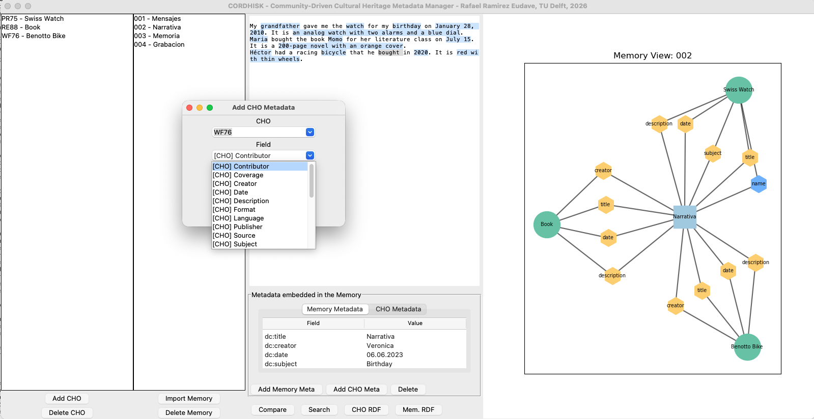

# CORDHISK App

A semantic annotation and knowledge graph tool for Cultural Heritage Objects (CHOs).

## Features

- Create and manage Cultural Heritage Objects
- Import and annotate memories
- Tag text with metadata fields (dc:, dcterms:)
- Compare metadata across memories
- Search memories
- Export RDF metadata
- Generate interactive knowledge graphs

## Installation

1. Clone repository
